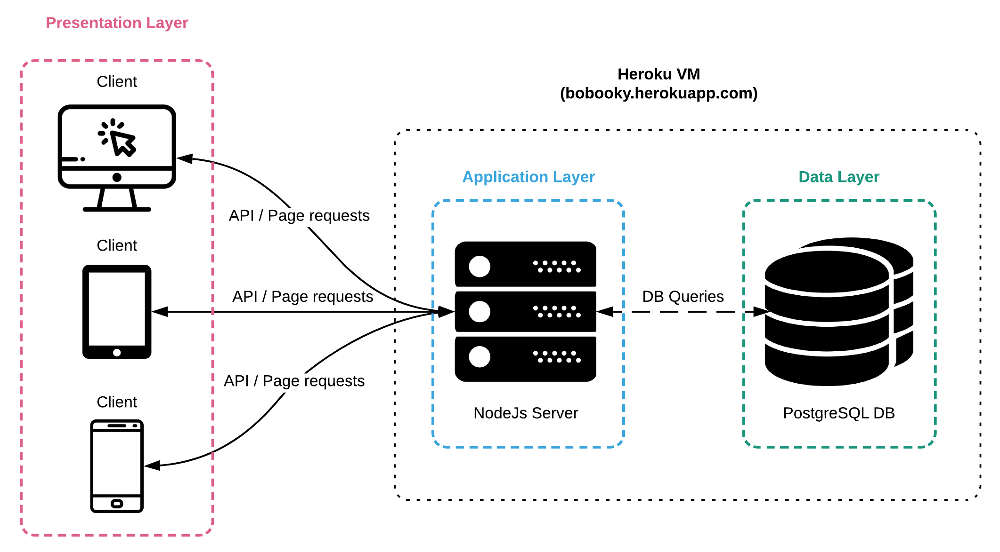

# Documentation of the Backend part
## -- This file will be converted to HTML later on --

> Deliverable D1

## General group information

| Member n. | Role          | First name | Last Name | Matricola | Email address   |
| --------- | ------------- | ---------- | --------- | --------- | --------------- |
| 1 | Administrator | Alberto Mario | Bellini | 893750 | albertomario.bellini@mail.polimi.it |
| 2 | Member | Luna Alessia | Rota | 895974 | lunaalessia.rota@mail.polimi.it |
| 3 | Member | Gianpaolo | Di Pietro | 899025 | gianpaolo.dipietro@mail.polimi.it |

## Links to other deliverables

- Deliverable D0: the web application is accessible at [this address](https://bobooky.herokuapp.com).
- Deliverable D2: the YAML file containing the specification of the app
  API can be found at [this address](https://bobooky.herokuapp.com/backend/spec.yaml).
- Deliverable D3: the SwaggerUI page of the same API is available at
  [this address](https://bobooky.herokuapp.com/backend/swaggerui).
- Deliverable D4: the source code of D0 is available as a zip file at
  [this address](https://bobooky.herokuapp.com/backend/app.zip).
- Deliverable D5: the address of the online source control repository is
  available [this address](https://github.com/ab3llini/BoBooky). We hereby declare that this
  is a private repository and, upon request, we will give access to the
  instructors.

## Specification
### Web Architecture
Describe here, with a diagram, the components of your web application and how
they interact. Highlight which parts belong to the application layer, data layer
or presentation layer. How did you ensure that HTML is not rendered server side?

Our application is composed by three main components: Application, Data and Presentation layers.

The Application Layer is where the NodeJs server runs and handles all the API requests and serves all the static pages.
We generated our raw server using the swagger tools and from there we started building our application functionality.
We serve everything within the /public directory using the express framework and we handle all API requests using the default swagger router.
Of course we had to implement ourselves all the API Services in order to respond to user requests.
For this purpose we had to use the PostgresSQL nodejs framework to perform queries to our database.
All queries are stored in the /other/db/query.js file and are executed from a database controller invoked by all the API Services.
To provide security we decided to exploit the PassportJS framework and we integrated it with the Swagger Security module in order to 
restrict access to certain API requests such as those who request private and/or sensible information such as private addresses or wishlists.

The Data Layer consists of a PostgreSQL database deployed on our Heroku VM instance. 
It is invoked by the NodeJS PostgreSQL Driver running on the application server and responds to all the queries with the requested data.
It has been filled with data coming from the publicly available dataset GoodBooks10K ([available on github](https://github.com/zygmuntz/goodbooks-10k)). 
The data has been first fully processed with Python scripts in order to filter out missing values, descriptions and much more. 
In the end our DB consists of approximately 700 books and 75 authors with plenty of genres, themes, images, descriptions and much more.
Furthermore, in order to create a reasonable amount of events, we run scripts to create them randomly. We wanted them to have realistic descriptions 
though and for this reason we exploited [OpenAI's GPT-2 Model](https://openai.com/blog/better-language-models/) to produce them given our randomly generated context.
We will dive into the database schema details later on in this document.

Finally the Presentation Layer consists of what the user see and interact with. It is made up by all the pages located within the /public folder and acts as the front-end layer of the application.
Throughout our asynchronous front-end api interface (/public/lib/utils/api.js) we make requests to the Application Layer and, once provided with the responses, we render content on the screen.
In order to have a much clear URL schema we decided to name every HTML file in our project structure as index.html within it's relative folder. 
This way we can navigate through the website by never seeing an url ending with .html since the browser will look automatically for the index in every folder.

Our backend has been developed using NodeJs and it's purpose it to serve static pages and handle API requests by interacting with the database.
For this reason we do not perform any kind of rendering on the server side and all HTML is rendered directly within the browser of the user.
We have created many components (located in /public/components) that are loaded with jQuery once the scripts are executed.
Thereby we do not perform any kind of remote rendering as many other web services do.
Components such as the navbar, the footer, dynamic page content (such as search results) and many more are loaded dynamically 
using a collection of tools that we have developed ourselves (public/lib/js/utils/template_loader.js).

### API

#### REST compliance

Describe here to what extent did you follow REST principles and what are the
reasons for which you might have decided to diverge. Note, you must not describe
the whole API here, just the design decisions.
#### OpenAPI Resource models

Describe here synthetically, which models you have introduced for resources.
### Data model

Describe with an ER diagram the model used in the data layer of your web
application. How these map to the OpenAPI data model?

## Implementation

### Tools used

Describe here which tools, languages and frameworks did you use for the backend
of the application.

languages
nodejs
scss WHY -> EXPLAIN css preprocessor 
css
html
js
jquery -> why ?? write less do more

framweokrs

backend:
var express = require('express');
var session = require("express-session"),
    bodyParser = require("body-parser");
var passport = require('passport');
var Strategy = require('passport-local').Strategy;
var swaggerTools = require('swagger-tools');
const {Client} = require('pg');

frontend:
bootstrap
font-awesome
jquery
multislider (carousel)

### Discussion

Describe here:
5
- How did you make sure your web application adheres to the provided OpenAPI
  specification?
- Why do you think your web application adheres to common practices to partition
  the web application (static assets vs. application data)
- Describe synthetically why and how did you manage session state, what are the
  state change triggering actions (e.g., POST to login etc..).
- Which technology did you use (relational or a no-SQL database) for managing
  the data model?

## Other information

### Task assignment

Describe here how development tasks have been subdivided among members of the
group, e.g.:
- Foo worked on front end (80%) and OpenAPI Spec (20% of the time)
- Bar worked on ....

- Alberto Mario Bellini worked both on the backend and on the frontend of the application.
For what concerns the backend he helped developing the OpenAPI specification (50%) and implemented 30% of the queries to the database.
He focused then his attention on how to integrate PassportJS with the application and how to perform user authentication.
He had to deal with cookies and PassportJS Integration and later he had to bind the user session with the API Specification to secure the queries.
In order to achieve the latter task he implemented the swagger security layer and bound it with the PassportJS authentication strategy.
For what concerns the frontend side of the application Alberto implemented the core (html skeletons, scss style and script implementation) of most of the pages (70%) 
created by our designer. 
It was anyway a synergy since small refinements were made even by other components of the group to the page that he had developed in the first place.
Alberto took care even of developing a series of utilities for interacting with the API Interface and others to load HTML components and handle user session.

### Analysis of existing API

Describe here if you have found relevant APIs that have inspired the OpenAPI
specification and why (at least two).

### Learning outcome

What was the most important thing all the members have learned while developing this part of the project, what questions remained unanswered, how you will use what you've learned in your everyday life?
Examples:
- Foo learned to write SQL queries and Javascript but wanted to know more about caching, he's probably going to create his own startup with what she has learned
- Bar learned how to deploy on a cloud platform, he would have liked to know
  more about promises for asynchronous code..
  
 - Alberto Mario Bellini learned the principles and the state of the art standards for making a fully working websites. He had used web technologies in the past but 
 never had the possibility to adopt a proper OpenAPI Specification in order to interact with the backend. This is something that he will carry in his personal toolbox forever.
 Furthermore he learnt the power of NodeJS and it's flexibility when it comes to deploying a web application. Its seamless interaction with all the components is just majestic and he will definitely use it again in the future.
 Nevertheless he discovered the robustness of the bootstrap framework and the incredible things that you can achieve with it. It is intuitive and simple to use, but at the same time you can use it 
 to build professional applications ready to be deployed in real life. It saves you countless hours of work and debugging and is a must-know framework when it comes to web developing.